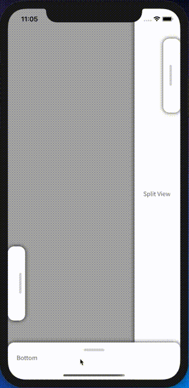

# Xamarin.Forms.DragView
*A draggable pane component for Xamarin.Forms*



## Usage

Inherit your view from DragView:
```xaml
<?xml version="1.0" encoding="UTF-8"?>
<dragview:DragView
    xmlns="http://xamarin.com/schemas/2014/forms"
    xmlns:x="http://schemas.microsoft.com/winfx/2009/xaml"
    xmlns:dragview="clr-namespace:Xamarin.Forms.DragView;assembly=Xamarin.Forms.DragView"
    x:Class="My.Namespace.MyDragView"

    MaxBounds="0.5"
    MinBounds="0.1">

    <!-- Your controls... -->
</dragview:DragView>
```

Place your custom DragView inside an AbsoluteLayout and dock it to the bottom:
```xaml
<AbsoluteLayout>
    <local:MyDragView
        AbsoluteLayout.LayoutFlags="PositionProportional, WidthProportional"
        AbsoluteLayout.LayoutBounds="0.5, 1, 1, AutoSize" />
</AbsoluteLayout>
```

MinBounds and MaxBounds denote the minimum and maximum space the DragView can take up, denoted as percentages of parent container's height.

See [DragView.xaml.cs](Xamarin.Forms.DragView/DragView.xaml.cs) for all bindable properties.
